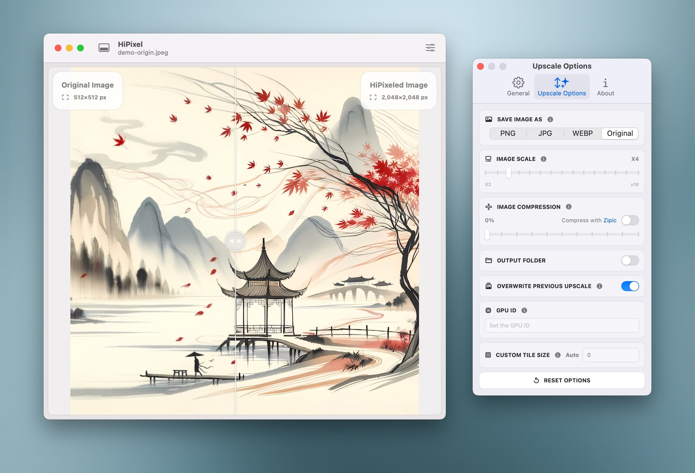

# HiPixel

<p align="center">
  
</p>

<h1 align="center">HiPixel</h1>

<p align="center">
  <a href="https://github.com/yourusername/hipixel/blob/main/LICENSE">
    
  </a>
  <a href="https://developer.apple.com/swift">
    
  </a>
  <a href="https://developer.apple.com/macos">
    
  </a>
  <a href="https://developer.apple.com/macos">
    
  </a>
</p>

<p align="center">
  <a href="#english">English</a> | <a href="#中文">中文</a>
</p>

---

<h2 id="english">AI-Powered Image Super-Resolution for macOS</h2>

HiPixel is a native macOS application for AI-powered image super-resolution, built with SwiftUI and leveraging Upscayl's powerful AI models.

<p align="center">
  
</p>

### ✨ Features

- 🖥️ Native macOS application with SwiftUI interface
- 🎨 High-quality image upscaling using AI models
- 🚀 Fast processing with GPU acceleration
- 🖼️ Supports various image formats
- 📁 Folder monitoring for automatic processing of newly added images
- 💻 Modern, intuitive user interface

### 💡 Why HiPixel?

While [Upscayl](https://github.com/upscayl/upscayl) already offers an excellent macOS application, HiPixel was developed with specific goals in mind:

1. **Native macOS Experience**
   - Built as a native SwiftUI application while utilizing Upscayl's powerful binary tools and AI models
   - Provides a seamless, platform-native experience that feels right at home on macOS

2. **Enhanced Workflow Efficiency**
   - Streamlined interaction with drag-and-drop processing - images are processed automatically upon dropping
   - Batch processing support for handling multiple images simultaneously
   - URL Scheme support for third-party integration, enabling automation and workflow extensions
   - Folder monitoring capability that automatically processes new images added to designated folders
   - Simplified interface focusing on the most commonly used features, making the upscaling process more straightforward

HiPixel aims to complement Upscayl by offering an alternative approach focused on workflow efficiency and native macOS integration, while building upon Upscayl's excellent AI upscaling foundation.

### 🔗 URL Scheme Support

HiPixel supports URL Scheme for processing images via external applications or scripts. The URL format is:

```
hipixel://?path=/path/to/image1&path=/path/to/image2
```

Example usage in Terminal:

```bash
# Process a single image
open "hipixel://?path=/Users/username/Pictures/image.jpg"

# Process multiple images
open "hipixel://?path=/Users/username/Pictures/image1.jpg&path=/Users/username/Pictures/image2.jpg"
```

Example usage in AppleScript:

```applescript
tell application "Finder"
    set selectedFiles to selection as alias list
    set urlString to "hipixel://"
    repeat with theFile in selectedFiles
        set urlString to urlString & "?path=" & POSIX path of theFile
    end repeat
    open location urlString
end tell
```

### 🚀 Installation

<p align="center">
  <a href="https://github.com/okooo5km/HiPixel/releases">
    
  </a>
</p>

1. Download the latest release from [GitHub Releases](https://github.com/okooo5km/HiPixel/releases)
2. Move HiPixel.app to your Applications folder
3. Launch HiPixel

> **Note**: HiPixel requires macOS 13.0 (Ventura) or later.

### 🛠️ Building from Source

1. Clone the repository

```bash
git clone https://github.com/okooo5km/hipixel
cd hipixel
```

2. Open HiPixel.xcodeproj in Xcode
3. Build and run the project

### 📝 License

HiPixel is licensed under the GNU Affero General Public License v3.0 (AGPLv3). This means:

- ✅ You can use, modify, and distribute this software
- ✅ If you modify the software, you must:
  - Make your modifications available under the same license
  - Provide access to the complete source code
  - Preserve all copyright notices and attributions

This software uses Upscayl's binaries and AI models, which are also licensed under AGPLv3.

### ☕️ Support the Project

If you find HiPixel helpful, please consider supporting its development:

- ⭐️ Star the project on GitHub
- 🐛 Report bugs or suggest features
- 💝 Support via:

<p align="center">
  <a href="https://buymeacoffee.com/okooo5km">
    
  </a>
</p>

<details>
<summary>More ways to support</summary>

- 🛍️ **[One-time Support via LemonSqueezy](https://okooo5km.lemonsqueezy.com/buy/4f1e3249-2683-4000-acd4-6b05ae117b40?discount=0)**

- **WeChat Pay**

  <p>
    
  </p>

- **Alipay**

  <p>
    
  </p>

</details>

Your support helps maintain and improve HiPixel!

### 👉 Recommended Tool

- **[Zipic](https://zipic.app)** - Smart image compression tool with AI optimization
  - 🔄 **Perfect Pairing**: After upscaling images with HiPixel, use Zipic for intelligent compression to reduce file size while maintaining clarity
  - 🎯 **Workflow Suggestion**: HiPixel upscaling → Zipic compression → Optimized output image
  - ✨ **Enhanced Results**: Compared to using either tool alone, combined use provides the optimal balance of quality and file size

Explore more [5KM Tech](https://5km.tech) products that bring simplicity to complex tasks.

### 🙏 Attribution

HiPixel uses the following components from [Upscayl](https://github.com/upscayl/upscayl):

- upscayl-bin - The binary tool for AI upscaling (AGPLv3)
- AI Models - The AI models for image super-resolution (AGPLv3)

Special thanks to [zaotang.xyz](https://zaotang.xyz) for designing the new application icon and main window interaction interface for HiPixel v0.2.

HiPixel also uses:

- [Sparkle](https://github.com/sparkle-project/Sparkle) - A software update framework for macOS applications (MIT License)
- [NotchNotification](https://github.com/Lakr233/NotchNotification) - A custom notch-style notification banner for macOS (MIT License)
- [GeneralNotification](https://github.com/okooo5km/GeneralNotification) - A custom notification banner for macOS (MIT License)

### 🌐 Infrastructure Support

[](https://dartnode.com "Powered by DartNode - Free VPS for Open Source")

We are grateful to [DartNode](https://dartnode.com) for supporting open source projects like HiPixel with their infrastructure services.

---

<h2 id="中文">macOS 原生的 AI 图像超分辨率工具</h2>

HiPixel 是一款原生 macOS 应用程序，用于 AI 图像超分辨率处理，使用 SwiftUI 构建，并采用 Upscayl 的强大 AI 模型。

<p align="center">
  
</p>

### ✨ 功能特点

- 🖥️ 原生 macOS 应用程序，使用 SwiftUI 界面
- 🎨 使用 AI 模型进行高质量图像放大
- 🚀 GPU 加速，处理速度快
- 🖼️ 支持多种图像格式
- 📁 文件夹监控功能，自动处理新增图像
- 💻 现代化直观的用户界面

### 💡 为什么选择 HiPixel？

虽然 [Upscayl](https://github.com/upscayl/upscayl) 已经提供了一个优秀的 macOS 应用程序，但是 HiPixel 是为了特定的目标而开发的：

1. **原生 macOS 体验**
   - 以原生 SwiftUI 应用程序的形式构建，同时利用 Upscayl 的强大二进制工具和 AI 模型
   - 提供一种无缝的、平台原生的体验，感觉就像在 macOS 上一样

2. **提高工作流效率**
   - 简化交互，支持拖放处理 - 图像在放下时会自动处理
   - 支持批量处理，能够同时处理多张图像
   - 支持 URL Scheme，能够与第三方应用程序集成，实现自动化和工作流扩展
   - 文件夹监控功能，自动处理添加到指定文件夹中的新图像
   - 简化界面，专注于最常用的功能，使得图像放大过程更加直接

HiPixel 旨在通过提供一种专注于工作流效率和原生 macOS 集成的替代方法来补充 Upscayl，同时建立在 Upscayl 优秀的 AI 图像放大基础之上。

### 🔗 URL Scheme 使用说明

HiPixel 支持 URL Scheme，用于通过外部应用程序或脚本处理图像。URL 格式如下：

```
hipixel://?path=/path/to/image1&path=/path/to/image2
```

在终端中的示例用法：

```bash
# 处理单张图像
open "hipixel://?path=/Users/username/Pictures/image.jpg"

# 处理多张图像
open "hipixel://?path=/Users/username/Pictures/image1.jpg&path=/Users/username/Pictures/image2.jpg"
```

在 AppleScript 中的示例用法：

```applescript
tell application "Finder"
    set selectedFiles to selection as alias list
    set urlString to "hipixel://"
    repeat with theFile in selectedFiles
        set urlString to urlString & "?path=" & POSIX path of theFile
    end repeat
    open location urlString
end tell
```

### 🚀 安装方法

<p align="center">
  <a href="https://github.com/okooo5km/HiPixel/releases">
    
  </a>
</p>

1. 从 [GitHub Releases](https://github.com/okooo5km/HiPixel/releases) 下载最新版本
2. 将 HiPixel.app 移动到应用程序文件夹
3. 启动 HiPixel

> **注意**：HiPixel 需要 macOS 13.0 (Ventura) 或更高版本。

### 🛠️ 从源代码构建

1. 克隆仓库

```bash
git clone https://github.com/okooo5km/hipixel
cd hipixel
```

2. 在 Xcode 中打开 HiPixel.xcodeproj
3. 构建并运行项目

### 📝 许可证

HiPixel 采用 GNU Affero 通用公共许可证第3版 (AGPLv3) 授权。这意味着：

- ✅ 您可以使用、修改和分发此软件
- ✅ 如果您修改了软件，您必须：
  - 在相同的许可证下提供您的修改
  - 提供完整源代码的访问
  - 保留所有版权声明和归属

本软件使用 Upscayl 的二进制文件和 AI 模型，这些也都采用 AGPLv3 许可。

### ☕️ 支持项目

如果您觉得 HiPixel 对您有帮助，可以通过以下方式支持项目的开发：

- ⭐️ 在 GitHub 上给项目点星
- 🐛 报告问题或提出建议
- 💝 赞助支持：

<p align="center">
  <a href="https://buymeacoffee.com/okooo5km">
    
  </a>
</p>

<details>
<summary>更多支持方式</summary>

- 🛍️ **[通过 LemonSqueezy 一次性支持](https://okooo5km.lemonsqueezy.com/buy/4f1e3249-2683-4000-acd4-6b05ae117b40?discount=0)**

- **微信支付**
  <p>
    
  </p>

- **支付宝**
  <p>
    
  </p>

</details>

您的支持将帮助我们持续改进 HiPixel！

### 👉 推荐工具

- **[Zipic](https://zipic.app)** - 智能图像压缩工具，搭配 AI 优化技术
  - 🔄 **完美搭配**: 使用 HiPixel 放大图像后，用 Zipic 进行智能压缩，在保持清晰度的同时减小文件体积
  - 🎯 **工作流建议**: HiPixel 放大 → Zipic 压缩 → 输出优化图像
  - ✨ **效果提升**: 相比单独使用任一工具，联合使用可获得质量与体积的最佳平衡

探索更多 [5KM Tech](https://5km.tech) 为复杂任务带来简单解决方案的产品。

### 🙏 致谢

HiPixel 使用了以下来自 [Upscayl](https://github.com/upscayl/upscayl) 的组件：

- upscayl-bin - AI 超分辨率处理工具
- AI Models - 图像超分辨率模型

特别感谢 [zaotang.xyz](https://zaotang.xyz) 为 HiPixel v0.2 版本设计了全新的应用图标和主窗口交互界面。

HiPixel 还使用了：

- [Sparkle](https://github.com/sparkle-project/Sparkle) - macOS 应用程序的软件更新框架 (MIT 许可证)
- [NotchNotification](https://github.com/Lakr233/NotchNotification) - 适用于 macOS 的刘海屏样式通知横幅 (MIT 许可证)
- [GeneralNotification](https://github.com/okooo5km/GeneralNotification) - 适用于 macOS 的自定义通知横幅 (MIT 许可证)

### 🌐 基础设施支持

[](https://dartnode.com "Powered by DartNode - Free VPS for Open Source")

感谢 [DartNode](https://dartnode.com) 为 HiPixel 等开源项目提供基础设施服务支持。
