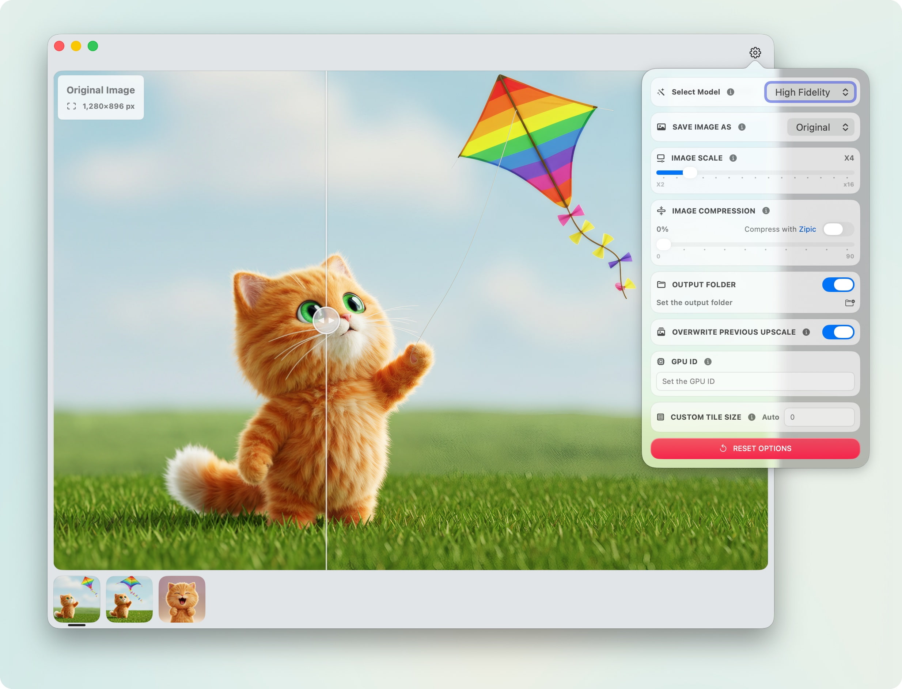

# HiPixel

使用我的应用也是 [支持我](https://5km.tech) 的一种方式：

<p align="center">
  <a href="https://zipic.app"></a>
  <a href="https://orchard.5km.tech"></a>
  <a href="https://apps.apple.com/cn/app/timego-clock/id6448658165?l=en-GB&mt=12"></a>
  <a href="https://keygengo.5km.tech"></a>
  <a href="https://hipixel.5km.tech"></a>
</p>

---

<p align="center">
  
</p>

<h1 align="center">HiPixel</h1>

<p align="center">
  <a href="https://github.com/yourusername/hipixel/blob/main/LICENSE">
    
  </a>
  <a href="https://developer.apple.com/swift">
    
  </a>
  <a href="https://developer.apple.com/macos">
    
  </a>
  <a href="https://developer.apple.com/macos">
    
  </a>
</p>

<p align="center">
  <a href="README.md">English</a> | <a href="README.zh-CN.md">中文</a>
</p>

---

## macOS 原生的 AI 图像超分辨率工具

HiPixel 是一款原生 macOS 应用程序，用于 AI 图像超分辨率处理，使用 SwiftUI 构建，并采用 Upscayl 的强大 AI 模型。

<p align="center">
  
</p>

## ✨ 功能特点

- 🖥️ 原生 macOS 应用程序，使用 SwiftUI 界面
- 🎨 使用 AI 模型进行高质量图像放大
- 🚀 GPU 加速，处理速度快
- 🖼️ 支持多种图像格式
- 📁 文件夹监控功能，自动处理新增图像
- 💻 现代化直观的用户界面

### 💡 为什么选择 HiPixel？

虽然 [Upscayl](https://github.com/upscayl/upscayl) 已经提供了一个优秀的 macOS 应用程序，但是 HiPixel 是为了特定的目标而开发的：

1. **原生 macOS 体验**
   - 以原生 SwiftUI 应用程序的形式构建，同时利用 Upscayl 的强大二进制工具和 AI 模型
   - 提供一种无缝的、平台原生的体验，感觉就像在 macOS 上一样

2. **提高工作流效率**
   - 简化交互，支持拖放处理 - 图像在放下时会自动处理
   - 支持批量处理，能够同时处理多张图像
   - 支持 URL Scheme，能够与第三方应用程序集成，实现自动化和工作流扩展
   - 文件夹监控功能，自动处理添加到指定文件夹中的新图像
   - 简化界面，专注于最常用的功能，使得图像放大过程更加直接

HiPixel 旨在通过提供一种专注于工作流效率和原生 macOS 集成的替代方法来补充 Upscayl，同时建立在 Upscayl 优秀的 AI 图像放大基础之上。

### 🔗 URL Scheme 使用说明

HiPixel 支持 URL Scheme，可通过外部应用程序或脚本处理图像。您可以通过 URL 查询参数指定图像处理选项，这些选项会覆盖应用程序中的默认设置。

#### 基本 URL 格式

```text
hipixel://?path=/path/to/image1&path=/path/to/image2
```

#### URL 参数说明

| 参数 | 类型 | 说明 | 示例值 |
|------|------|------|--------|
| `path` | String | **必需。** 图像文件或文件夹的路径。可以通过重复此参数指定多个路径。 | `/Users/username/Pictures/image.jpg` |
| `saveImageAs` | String | 输出图像格式。 | `PNG`, `JPG`, `WEBP`, `Original` |
| `imageScale` | Number | 放大倍数（乘数）。 | `2.0`, `4.0`, `8.0` |
| `imageCompression` | Number | 压缩级别（0-99）。仅在未使用 Zipic 压缩时生效。 | `0`, `50`, `90` |
| `enableZipicCompression` | Boolean | 启用 Zipic 压缩（需要安装 Zipic 应用）。 | `true`, `false`, `1`, `0` |
| `enableSaveOutputFolder` | Boolean | 将输出保存到自定义文件夹，而不是源文件所在目录。 | `true`, `false`, `1`, `0` |
| `saveOutputFolder` | String | 自定义输出文件夹路径（URL 编码）。需要 `enableSaveOutputFolder=true`。 | `/Users/username/Output` |
| `overwritePreviousUpscale` | Boolean | 如果已存在放大后的图像，是否覆盖。 | `true`, `false`, `1`, `0` |
| `gpuID` | String | 用于处理的 GPU ID。空字符串使用默认 GPU。 | `0`, `1`, `2` |
| `customTileSize` | Number | 处理的自定义图块大小。`0` 表示使用默认值。 | `0`, `128`, `256`, `512` |
| `customModelsFolder` | String | AI 模型的自定义文件夹路径（URL 编码）。 | `/Users/username/Models` |
| `upscaylModel` | String | 要使用的内置 AI 模型。 | `upscayl-standard-4x`, `upscayl-lite-4x`, `high-fidelity-4x`, `digital-art-4x` |
| `selectedCustomModel` | String | 要使用的自定义模型名称。与 `upscaylModel` 冲突（自定义模型优先）。 | `my-custom-model` |
| `doubleUpscayl` | Boolean | 启用双重放大（放大两次以获得更高分辨率）。 | `true`, `false`, `1`, `0` |
| `enableTTA` | Boolean | 启用测试时间增强以获得更好的质量（处理速度较慢）。 | `true`, `false`, `1`, `0` |

#### 使用示例

**终端：**

```bash
# 使用默认设置处理单张图像
open "hipixel://?path=/Users/username/Pictures/image.jpg"

# 处理多张图像
open "hipixel://?path=/Users/username/Pictures/image1.jpg&path=/Users/username/Pictures/image2.jpg"

# 使用自定义选项：4倍放大、PNG 格式、启用双重放大
open "hipixel://?path=/Users/username/Pictures/image.jpg&imageScale=4.0&saveImageAs=PNG&doubleUpscayl=true"

# 使用自定义输出文件夹和 Zipic 压缩
open "hipixel://?path=/Users/username/Pictures/image.jpg&enableSaveOutputFolder=true&saveOutputFolder=/Users/username/Output&enableZipicCompression=true"

# 使用特定 AI 模型并启用 TTA
open "hipixel://?path=/Users/username/Pictures/image.jpg&upscaylModel=high-fidelity-4x&enableTTA=true"
```

**AppleScript：**

```applescript
tell application "Finder"
    set selectedFiles to selection as alias list
    set urlString to "hipixel://"
    set firstFile to true
    repeat with theFile in selectedFiles
        if firstFile then
            set urlString to urlString & "?path=" & POSIX path of theFile
            set firstFile to false
        else
            set urlString to urlString & "&path=" & POSIX path of theFile
        end if
    end repeat
    -- 添加处理选项
    set urlString to urlString & "&imageScale=4.0&saveImageAs=PNG"
    open location urlString
end tell
```

**Shell 脚本：**

```bash
#!/bin/bash
# 使用自定义设置处理文件夹中的所有图像

IMAGE_PATH="/Users/username/Pictures"
OUTPUT_FOLDER="/Users/username/Upscaled"

for image in "$IMAGE_PATH"/*.{jpg,jpeg,png}; do
    if [ -f "$image" ]; then
        open "hipixel://?path=$image&imageScale=4.0&enableSaveOutputFolder=true&saveOutputFolder=$OUTPUT_FOLDER&doubleUpscayl=true"
    fi
done
```

#### 注意事项

- 除 `path` 外的所有参数都是可选的。如果未指定，应用程序将使用在应用偏好设置中配置的默认设置。
- 可以指定多个 `path` 参数，以在单次调用中处理多张图像或文件夹。
- 布尔值接受：`true`, `false`, `1`, `0`, `yes`, `no`, `on`, `off`（不区分大小写）。
- 包含特殊字符的文件路径和文件夹路径应进行 URL 编码。
- 当同时指定 `upscaylModel` 和 `selectedCustomModel` 时，`selectedCustomModel` 优先。
- 如果 `enableSaveOutputFolder=true` 但未提供 `saveOutputFolder`，输出将保存在源图像所在的目录中。

### 🚀 安装方法

<p align="center">
  <a href="https://hipixel.5km.tech">
    
  </a>
</p>

1. 访问 [hipixel.5km.tech](https://hipixel.5km.tech) 下载最新版本
2. 将 HiPixel.app 移动到应用程序文件夹
3. 启动 HiPixel

> **注意**：HiPixel 需要 macOS 13.0 (Ventura) 或更高版本。

### 🛠️ 从源代码构建

1. 克隆仓库：

```bash
git clone https://github.com/okooo5km/hipixel
cd hipixel
```

2. 在 Xcode 中打开 HiPixel.xcodeproj
3. 构建并运行项目

### 📝 许可证

HiPixel 采用 GNU Affero 通用公共许可证第3版 (AGPLv3) 授权。这意味着：

- ✅ 您可以使用、修改和分发此软件
- ✅ 如果您修改了软件，您必须：
  - 在相同的许可证下提供您的修改
  - 提供完整源代码的访问
  - 保留所有版权声明和归属

本软件使用 Upscayl 的二进制文件和 AI 模型，这些也都采用 AGPLv3 许可。

### ☕️ 支持项目

如果您觉得 HiPixel 对您有帮助，可以通过以下方式支持项目的开发：

- ⭐️ 在 GitHub 上给项目点星
- 🐛 报告问题或提出建议
- 💝 赞助支持：

<p align="center">
  <a href="https://www.buymeacoffee.com/okooo5km" target="_blank"></a>
</p>

<details>
<summary>更多支持方式</summary>

- 🛍️ **[通过 LemonSqueezy 一次性支持](https://okooo5km.lemonsqueezy.com/buy/4f1e3249-2683-4000-acd4-6b05ae117b40?discount=0)**

- **微信支付**
  <p>
    
  </p>

- **支付宝**
  <p>
    
  </p>

</details>

您的支持将帮助我们持续改进 HiPixel！

### 👉 推荐工具

- **[Zipic](https://zipic.app)** - 智能图像压缩工具，搭配 AI 优化技术
  - 🔄 **完美搭配**: 使用 HiPixel 放大图像后，用 Zipic 进行智能压缩，在保持清晰度的同时减小文件体积
  - 🎯 **工作流建议**: HiPixel 放大 → Zipic 压缩 → 输出优化图像
  - ✨ **效果提升**: 相比单独使用任一工具，联合使用可获得质量与体积的最佳平衡

探索更多 [5KM Tech](https://5km.tech) 为复杂任务带来简单解决方案的产品。

### 🙏 致谢

HiPixel 使用了以下来自 [Upscayl](https://github.com/upscayl/upscayl) 的组件：

- upscayl-bin - AI 超分辨率处理工具
- AI Models - 图像超分辨率模型

特别感谢 [zaotang.xyz](https://zaotang.xyz) 为 HiPixel v0.2 版本设计了全新的应用图标和主窗口交互界面。

HiPixel 还使用了：

- [FSWatcher](https://github.com/okooo5km/FSWatcher) - 高性能的 Swift 原生文件系统监控库，支持 macOS 和 iOS 智能监听 (MIT 许可证)
- [Sparkle](https://github.com/sparkle-project/Sparkle) - macOS 应用程序的软件更新框架 (MIT 许可证)
- [NotchNotification](https://github.com/Lakr233/NotchNotification) - 适用于 macOS 的刘海屏样式通知横幅 (MIT 许可证)
- [GeneralNotification](https://github.com/okooo5km/GeneralNotification) - 适用于 macOS 的自定义通知横幅 (MIT 许可证)

